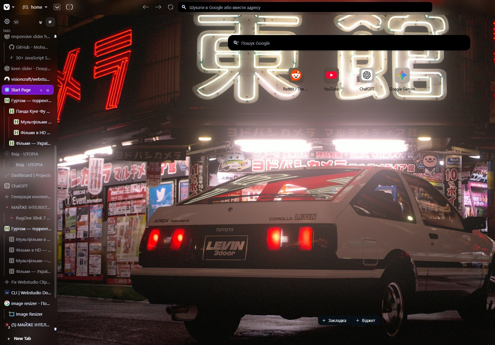

# TreeTabsVivaldi



TreeTabsVivaldi is a custom Vivaldi browser UI mod that adds a Sidebery-inspired vertical tree tab panel to the left side of the browser window.

It is not a browser extension. It is a `custom.js` UI modification loaded into Vivaldi's `window.html`.

## 🔥 Latest Updates (v2.0)

- **Native Windows Auto-Updater (`svb-updater.exe`)**: A lightweight background tray application that automatically checks for mod updates on GitHub, fetches release notes, and interactively asks if you want to install them. It completely automates the hassle of manually copying files after every Vivaldi update!
- **Folders for Tabs**: You can now group your tabs into fully functional, collapsible folders (just like Sidebery) that integrate seamlessly with the native Vivaldi workspace system. You can even pin folders, bringing the experience much closer to modern browsers like **Arc** or **Zen Browser**!
- **Enhanced Context Menu**: The custom context menu has been completely redesigned. It now supports bulk actions for multiple selected tabs, moving entire trees between workspaces/windows, saving trees as Vivaldi bookmarks, and closing entire subtrees safely.
- **Improved Stability & Anti-Orphan Logic**: Deeply improved tab synchronization prevents ghost tabs and infinite loops when Vivaldi naturally moves tabs between workspaces. Context locks prevent UI flickering during rapid bulk tab operations.

## What It Does

- Adds a vertical tab panel with a Sidebery-like visual style.
- Supports hierarchical tree tabs with nested parent/child relations.
- Persists tree structure and collapsed/expanded state across browser restarts.
- Synchronizes with native Vivaldi workspaces.
- Keeps the native tab order aligned with the custom tree order.
- Supports pinned tabs, tab renaming, tab colors, mute/unmute, duplicate, close actions, and custom context menus.
- Supports multi-select and drag-and-drop between tree levels.
- Supports moving tabs or whole trees to another workspace or a new window.
- Supports saving a tree as a Vivaldi bookmarks folder and restoring it later.
- Supports Vivaldi native tiling from the custom multi-selection.
- Supports a pinned/auto-hide panel mode and resizable panel width.
- Hides itself during fullscreen video/browser fullscreen.

## Project Structure

```text
vivaldi-mod/
  src/              Source modules
  build/            Custom bundler
  dist/custom.js    Built Vivaldi mod bundle
  package.json      Build scripts
```

The source code is modular, but the final output is a single file:

```text
dist/custom.js
```

## Installation

### Windows (Recommended)

The easiest way to install and maintain the mod on Windows is using the native **Auto-Updater** (`svb-updater.exe`). It sits quietly in your system tray, detects when Vivaldi updates, and automatically re-applies the mod for you. It also notifies you of new mod updates from GitHub!

1. Download the `svb-updater.exe` file from the [Releases](https://github.com/R0STEFAN/Vivaldi-Tree-Style-Tabs/releases) page.
2. Place the file in a permanent folder where you want to keep it (e.g., `Documents\VivaldiTreeTabs`).
3. Run `svb-updater.exe`. It will automatically download the required mod files from GitHub, find your Vivaldi installation, and apply the mod.
4. *(Optional)* Right-click the tray icon and enable "Run on Startup" to ensure Vivaldi is always patched automatically.

**Manual Patcher (Alternative)**
If you are building from source or prefer not to use the background updater:
- Double-click `patch-windows.bat` or run it from CMD/PowerShell. It will automatically detect your Vivaldi path, copy `custom.js`, and inject the script.
- *Note: You will need to run `patch-windows.bat` manually after every browser update.*

### Linux (Arch-based)

The project includes an automatic installer that sets up a Pacman Hook to keep the mod active after system updates.

1. **Build the project** (or download the pre-built files):
   ```bash
   npm run build
   ```
2. **Run the installer:**
   ```bash
   bash install-linux.sh
   ```
   *What it does:*
   - Copies `custom.js` to `~/.local/share/vivaldi-patch/`.
   - Creates a patching script that injects the mod into Vivaldi's `window.html`.
   - Sets up a **Pacman Hook** (`/etc/pacman.d/hooks/vivaldi-patch.hook`) that automatically re-applies the patch every time Vivaldi is updated via the package manager.

If you don't want the hook and just want a one-time patch, you can use:
```bash
sudo bash patch-linux.sh
```

### macOS

The repo includes `install-macos.sh` and `uninstall-macos.sh`, plus matching npm scripts.

1. **Install:**
   ```bash
   npm run install:macos
   ```
   *What it does:*
   - Runs `npm run build` to produce a fresh `dist/custom.js`.
   - Resolves the Vivaldi resources dir (default `/Applications/Vivaldi.app/Contents/Frameworks/Vivaldi Framework.framework/Versions/Current/Resources/vivaldi`).
   - Backs up `window.html` to `window.html.bak` (only the first time, so the pristine original is preserved across re-installs).
   - Copies `dist/custom.js` into the resources dir.
   - Injects `<script src="custom.js"></script>` before `</body>` in `window.html`.
   - Auto-detects whether `sudo` is needed based on file ownership and only escalates if necessary.

2. **Uninstall:**
   ```bash
   npm run uninstall:macos
   ```
   Restores `window.html` from `window.html.bak` if present, otherwise surgically removes the injected `<script>` line, then deletes `custom.js`.

3. **Custom Vivaldi paths** (e.g. Vivaldi Snapshot):
   ```bash
   bash install-macos.sh /Applications/Vivaldi Snapshot.app
   bash uninstall-macos.sh /Applications/Vivaldi Snapshot.app
   ```

*Notes:*
- After every Vivaldi auto-update the resources directory is replaced, wiping the mod. Re-run `npm run install:macos` to reapply.
- Modifying files inside `Vivaldi.app` invalidates the code signature. macOS may show a Gatekeeper warning on first launch after install; dismiss it once and Vivaldi continues to work normally.
- Pass `-y` / `--yes` to skip the "Vivaldi is currently running" prompt.

### Manual Installation (All platforms)

If you prefer to manually inject the mod without scripts:
1. Close Vivaldi.
2. Locate Vivaldi's browser UI resources directory (`window.html`).
3. Back up `window.html` to `window.html.bak`.
4. Copy the built bundle `dist/custom.js` into the resources folder.
5. Add `<script src="custom.js"></script>` to `window.html` right before `</body>`.
6. Start Vivaldi. (Repeat after every browser update).

## Developer Setup

Install dependencies:

```bash
cd vivaldi-mod
npm install
```

Build once:

```bash
npm run build
```

Watch source files and rebuild automatically:

```bash
npm run watch
```

The build command writes:

```text
vivaldi-mod/dist/custom.js
```

## Developer Copy Workflow

For local development on Linux stable Vivaldi:

```bash
cd vivaldi-mod
npm run build

VIVALDI_DIR="/opt/vivaldi/resources/vivaldi"
sudo cp dist/custom.js "$VIVALDI_DIR/custom.js"
```

If `window.html` does not already include the mod script, add it once:

```bash
VIVALDI_DIR="/opt/vivaldi/resources/vivaldi"
grep -q 'custom.js' "$VIVALDI_DIR/window.html" || \
  sudo sed -i 's#</body>#  <script src="custom.js"></script>\n</body>#' "$VIVALDI_DIR/window.html"
```

Then restart Vivaldi.

For Vivaldi Snapshot, change the path:

```bash
VIVALDI_DIR="/opt/vivaldi-snapshot/resources/vivaldi"
```

## Recommended Vivaldi Settings

The mod is designed to replace the native tab strip visually. You can keep the native tab strip enabled while testing, but for normal use it is recommended to hide or move the native tab bar through Vivaldi settings.

Native Vivaldi workspaces remain supported and are used by the custom panel.

## Important Notes

- This mod relies on Vivaldi-specific browser APIs and some internal runtime behavior.
- A Vivaldi update can break parts of the integration, especially workspace, tiling, or window-moving features.
- Always keep a backup of the original `window.html`.
- This project is intended for users who are comfortable modifying Vivaldi's application files.

## Build Output

The repository should commit source files and may optionally include the latest `dist/custom.js` build for direct installation.

To regenerate the bundle:

```bash
npm run build
```

